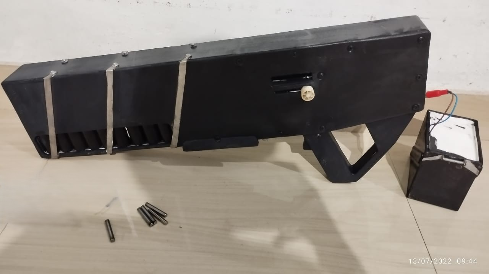
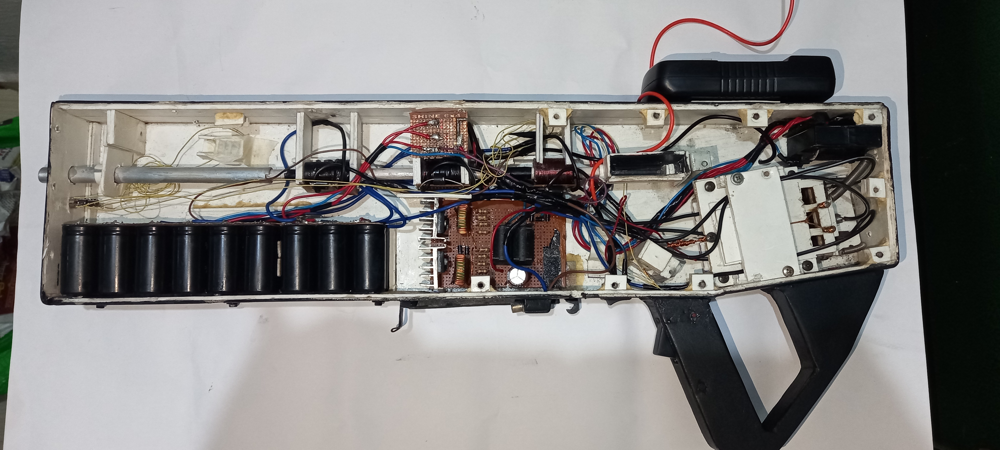

# 3-Stage Arduino Coil Gun (Gauss Gun)

A high-voltage, sequentially fired **3-stage electromagnetic coil gun** controlled by an **Arduino Nano**. Each stage has its own capacitor bank and uses parallel **60N60 IGBTs** for high-current switching.

## Project Overview

This project is a fully programmable 3-stage coil gun that accelerates a ferromagnetic projectile using three electromagnetic coils fired in rapid succession. The Arduino Nano manages all critical functions including boost converter control, high-voltage monitoring, safety discharge, and precise sequential firing.

## Features

- Three independent capacitor banks and coils
- Sequential firing: Coil 1 → Coil 2 → Coil 3 with adjustable pulse timing and delays
- Arduino-controlled 12V to 400V boost converter
- Real-time voltage monitoring (Battery + Capacitor banks)
- Automatic safe discharge on startup and when idle
- Manual discharge through 200W bleed resistor
- Trigger lockout below minimum safe voltage
- Comprehensive safety timeouts and protections
- Detailed Serial Monitor output for debugging
- Status LEDs for system state

## Operation

1. Power on the system → Automatic capacitor discharge (safety)
2. Press and hold **Charge** button to charge capacitors to ~400V
3. Wait until system shows "Ready" status
4. Press **Trigger** button to fire the 3-stage sequence
5. System automatically returns to safe state after firing

## Safety Warnings

**This is a high-energy, high-voltage project. Extreme caution is required.**

- Capacitors store lethal energy at 400V
- Always assume capacitors are charged
- Never touch the circuit while capacitors may be live
- Use proper insulation and physical barriers
- Eye protection is mandatory during operation
- The bleed resistor becomes extremely hot during discharge

**Use this project at your own risk and responsibly.**

## Hardware Components

- **Microcontroller:** Arduino Nano
- **Power Source:** 12V LiPo battery
- **Switching:** 3 × 60N60 IGBTs per stage (9 total)
- **Charging:** 12V → 400V DC boost converter
- **Discharge:** 200W power resistor with IGBT switch
- **Sensors:** High-voltage and battery voltage dividers

---

## HARDWARE NOTES - READ BEFORE BUILDING

**These notes are critical for safe and reliable operation.**

### GATE DRIVE
The Nano's GPIO can only source ~40mA *total*. Driving 3x 60N60 IGBT gates in parallel directly from Arduino is **NOT viable**.

**Use a dedicated gate driver per stage.** Recommended drivers:
- TC4420 / TC4422
- UCC27324 (4A dual)
- IR2110

**Wiring per stage:**
- Arduino GPIO → Gate Driver input
- Gate Driver output → 10-20Ω resistor → IGBT gates (parallel)
- **Individual 10k pull-down** on each IGBT gate to emitter

> Never use a single shared gate resistor for parallel IGBTs. Pull-downs prevent accidental firing if Arduino resets.

### HIGH-VOLTAGE SENSING DIVIDER
- Top resistor: 9 × 100k (1/4W) in series (~900k)
- Bottom resistor: 10k
- Add 5.1V Zener diode across ADC pin
- Short sense wire with 100Ω series resistor near Arduino

Calibrate the divider constant using a multimeter.

### BATTERY SENSING DIVIDER
- For 3S LiPo: 10k / 3.3k
- For 4S: Use 2.7k bottom resistor

### BLEED RESISTOR
Target ~1000Ω total resistance. Must be rated **200W+**. Use wirewound power resistors. Bleed IGBT must handle full 400V+.

### BOOST CONVERTER & CAPACITOR BANK
- Verify EN pin logic (HIGH or LOW active)
- Add ~500V TVS/MOV protection across each bank
- Include slow-blow fuse on boost output

### EMI & ARDUINO RESET PROTECTION
High dI/dt pulses can reset the Arduino. Recommended mitigations:
- Strong decoupling capacitors on Arduino VCC
- Series resistors on signal lines
- Physical separation between logic and HV sections
- Optional opto-isolation

**The 10k gate pull-downs are your last line of defense.**

### Add changes to the code based on your requirment
**[View the Main Script](coil_gun.ino)**

### "NOTE"
**WARNING:** This is a high-voltage experimental project. Use entirely at your own risk. The author assumes no liability for any damage, injury, or harm to persons or property.

---

